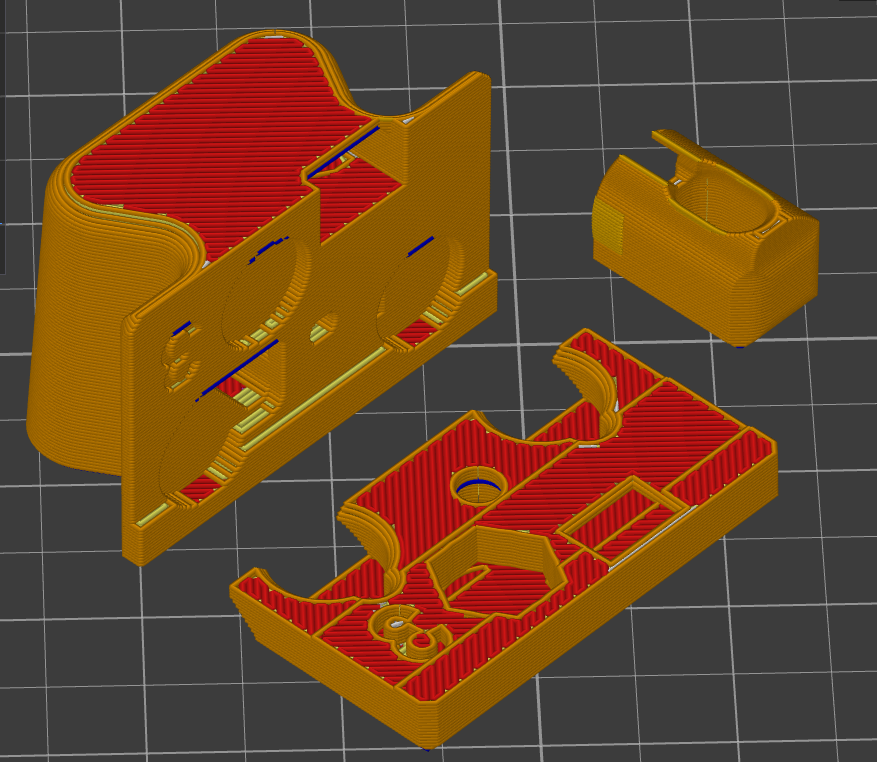
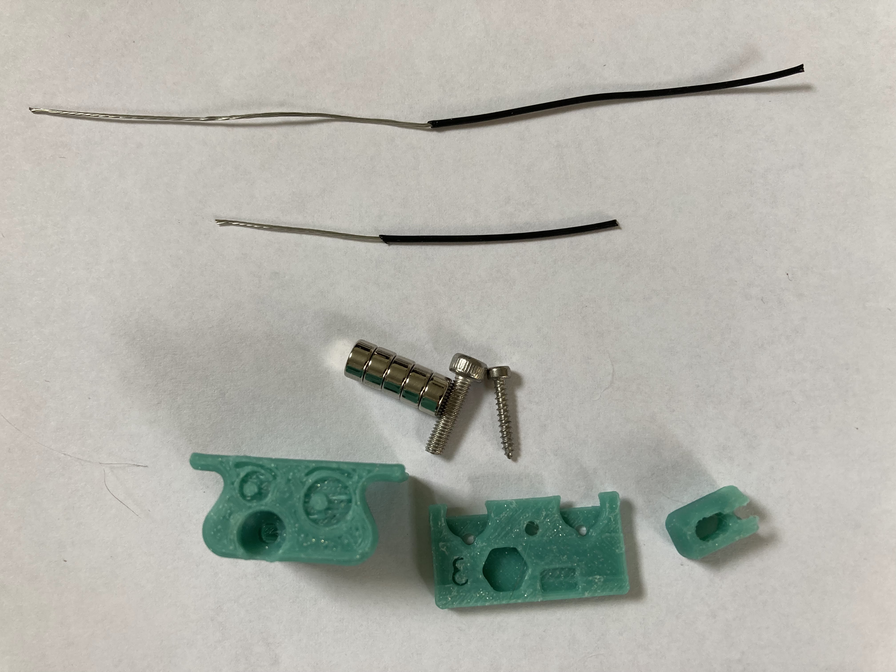
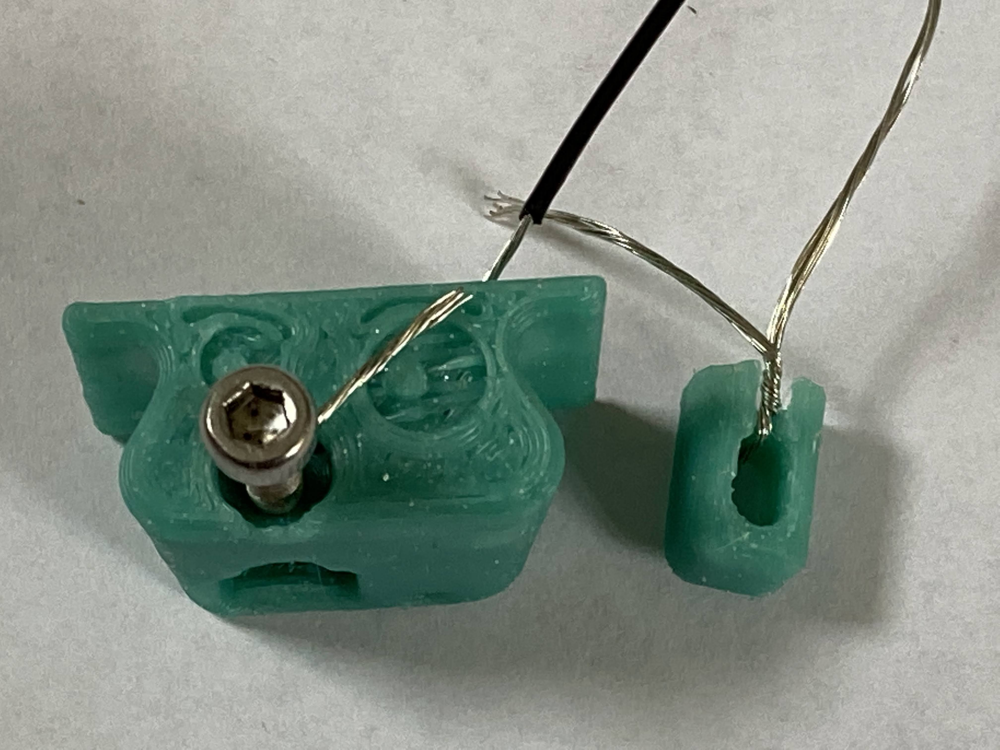
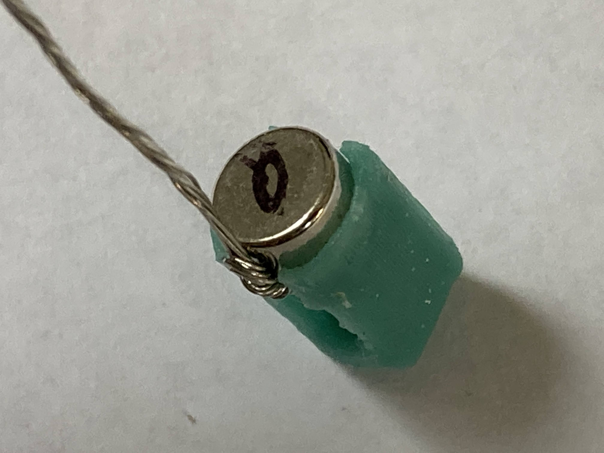
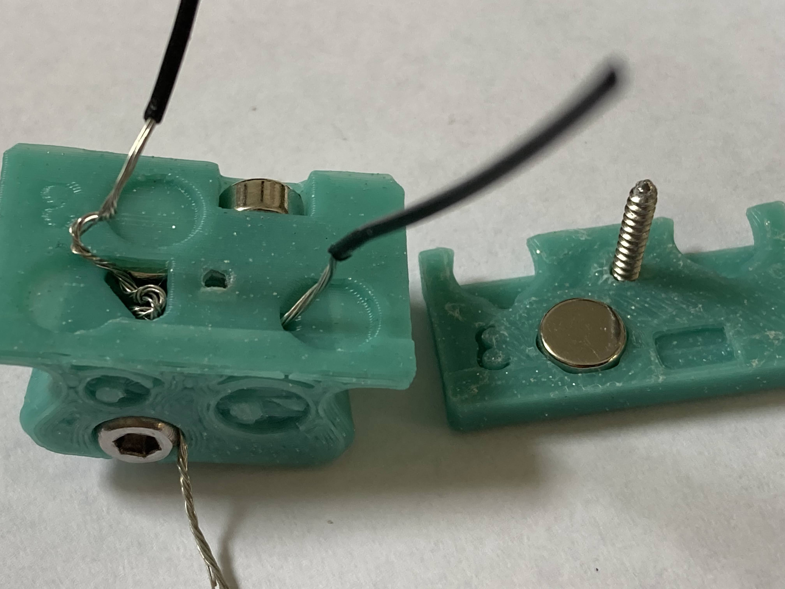
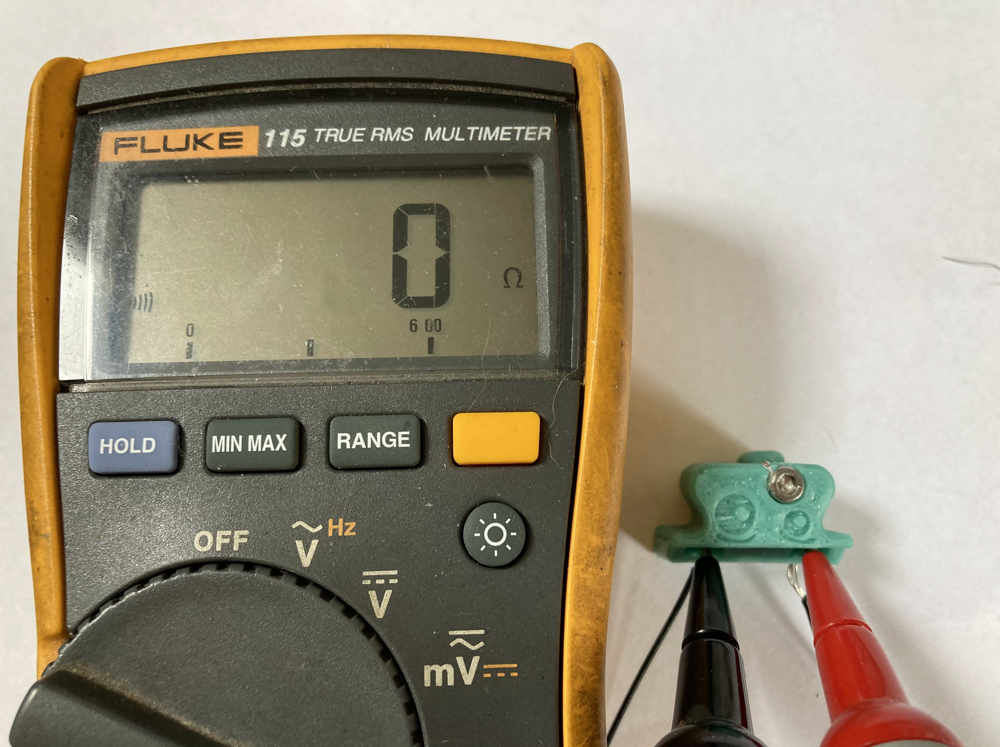
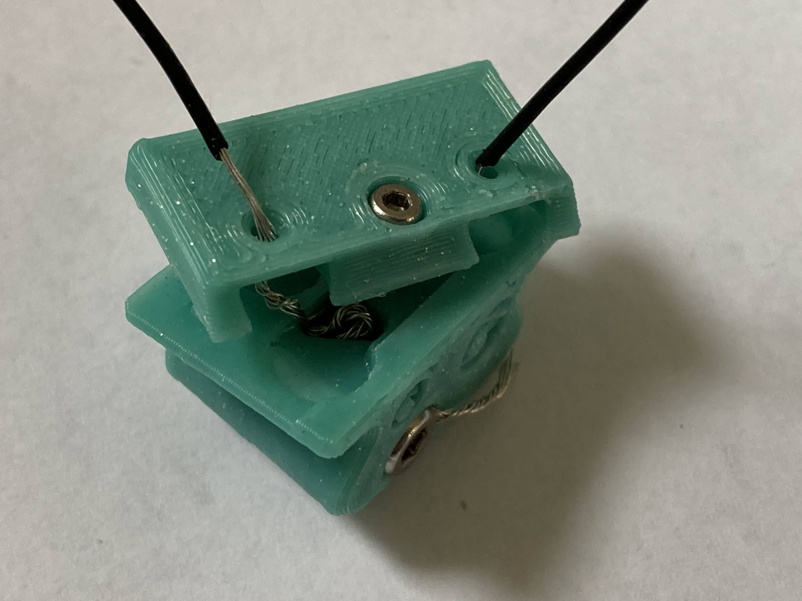
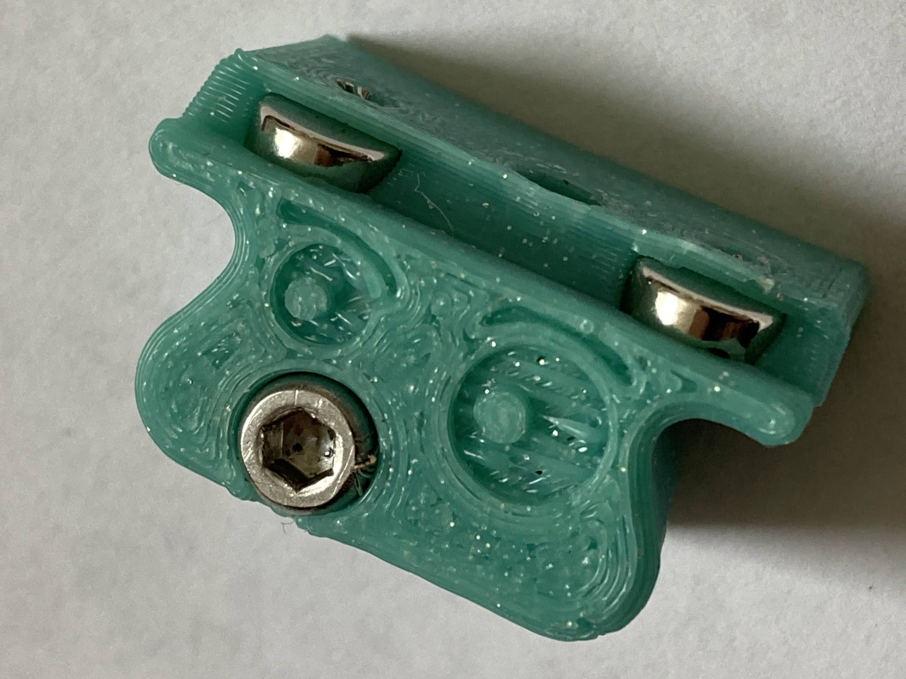

## UnklickyNG BFP (WIP)

#### Printing

* Forced 0.4mm perimeter
* 5 bottom and top layer 
* 30% + infill 

#### BOM 

* 5 - 6x3mm magnets
* 1 - M3x12mm SHCS 
* 1 - M2x12mm or M2x10mm self tapping screw 
* 60mm 24awg wires 

#### Assembly

1. Insert Wires. Put three twists on the pin.

2. Insert pin magnet and trim wire. 

3. Insert pin, and screw in the M3 completely. Leave extra wires until the end so that wires can be reused if you make a mistake. Add magnets as seen here. The magnet in the cap is a light press fit.

4. Screw the cap on completely with the M2. Check for continuity and pin action.

5. Unscrew the cap a few milimeters and sneak the two front magnets in. Tip: pivot the cap by pressing on the back edge.

6. Trim all wires. Make sure that the top is flush. If there are extra bits of wire sticking out, push them down with a small allen key.
